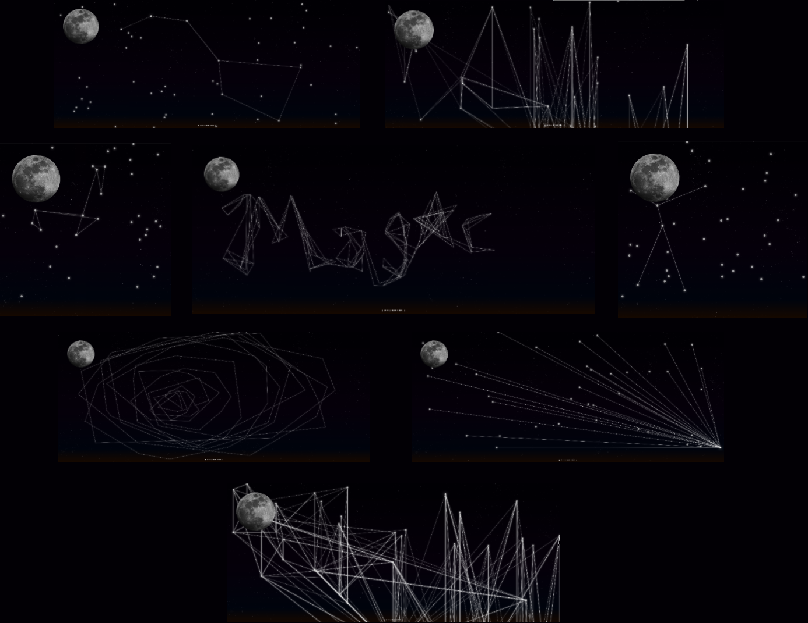

# Musica Universalis

#### By Cory Nordenbrock
##### 3/14/20

## Deployment

* [Live site](http://www.musica-universalis.com/) hosted on Heroku.

## _What_ does it do?

* Musica Universalis is an interactive web app that allows a user to draw "musical constellations" on the backdrop of a twinkling night sky. Upon loading the page, clickable stars will randomly be scattered across the page with a randomly-assigned note value that resonates as the user draws from star to star by clicking on different stars. At the bottom of the page is a toggle-able "Navigation" component with a "Ground Control" feature that allows the user to configure star quantity, line quantity, and note-theme presets. Also, features a talking moon...

## _Why_ does it do?

* This web app served as my capstone project as part of the October 2020 cohort at [Epicodus](https://www.epicodus.com/). That, and you might say it also momentarily fulfills my childhood aspirations of becoming an astronaut.

## Examples

## Setup Instructions

* Basic Requirements
1. In order to utilize react-scripts, build the app, and run a local server, [Node.JS](https://nodejs.org/en/download/) must be installed. If using NPM as your package manager, your version will need to be at least 5.2.0 or newer. If you have an older version of NPM, run the following command in the terminal to update it: ` npm install -g npm `

* To run program locally:

1. Using your preferred terminal/CLI, clone this repository: ` git clone https://github.com/cordenbrock/musica-universalis.git `
2. Navigate to the root directory: ` cd musica-universalis `
3. Open with VScode or preferred IDE: ` code . `
4. Install all dependencies: ` npm install `
5. Serve up the app: ` npm start `
6. The last command should automatically open http://localhost:3000 in your default web browser to then use the app, otherwise enter the aformenetioned URL in your browser-of-choice manually.

## Built with/Tools used

* _React/Create-React-App_
* _CSS, Styled-Components, Material-UI_
* _HTML_
* _Tone.js_
* _Canvas_
* _Heroku_
* _VSCode_

### Known Bugs/Future Improvements

* Add more note/chord theme presets
* Add more synth/tone presets
* Add feature to enable user submissions of constellations and post into a "Gallery"
* Polish up styling

### Legal

MIT License, (c) 2020 Cory Nordenbrock
